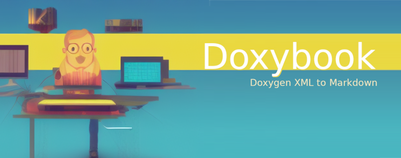

# Doxybook

> Doxygen XML to Markdown

<!--[abstract -->

 

Generate beautiful C++ documentation by converting Doxygen XML output into
markdown pages via [MkDocs](https://www.mkdocs.org/), [Hugo](https://gohugo.io/)
, [VuePress](https://vuepress.vuejs.org/), [GitBook](https://github.com/GitbookIO/gitbook)
, [Docsify](https://docsify.js.org/#/), or your custom generator. Also comes with an optional templating mechanism and
extensive configuration file.

 

 

<!-- https://github.com/bradvin/social-share-urls -->

 

<!--] -->

 

<h2>

[READ THE DOCUMENTATION FOR A QUICK START AND EXAMPLES](https://alandefreitas.github.io/doxybook/)

</h2>

