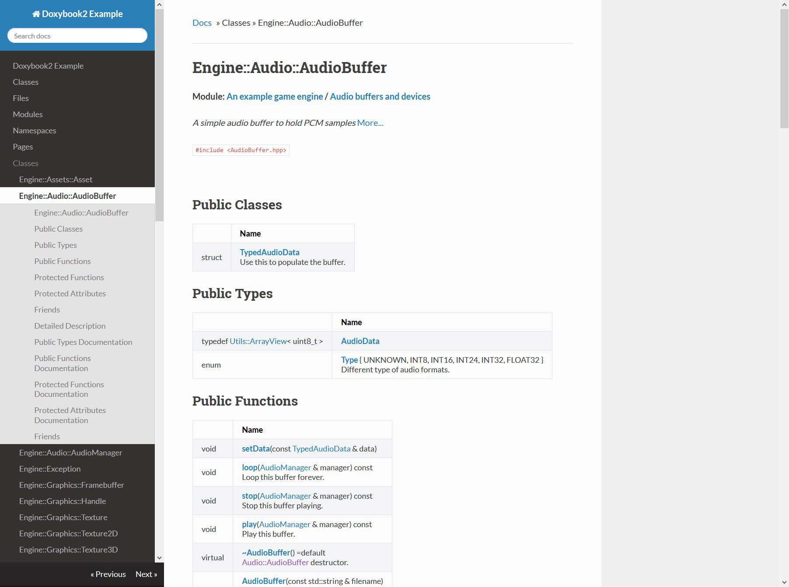
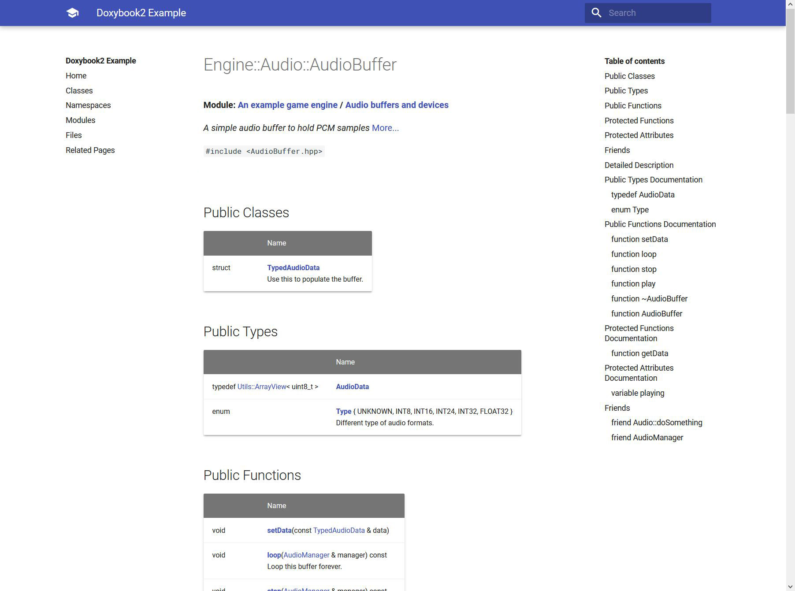

# Quickstart

## Integration 💻

!!! example ""

    === "Packages"
    
        Get the binary packages from the [release section](https://github.com/alandefreitas/doxybook/releases).
    
        Put the binary file (`doxybook` or `doxybook.exe`) somewhere in your system and add it to the 
        OS `PATH` environment variable.

        !!! hint
            
            If you need a more recent version of `doxybook`, you can download the binary packages from the
            CI artifacts or build the library from the source files.
    
    === "From source"
    
        We do not provide binary packages for all platforms. In that case, you can build the package from 
        source. Any dependencies unavailable will be downloaded during configuration. You can also use
        a CMake package manager toolchain, such as vcpkg, to download these dependencies. 

        === "Windows + MSVC"
        
            Build:            

            ```bash
            cmake -S . -B build -D CMAKE_BUILD_TYPE=Release -D CMAKE_CXX_FLAGS="/O2"
            cmake --build build --config Release
            ```
            
            Install:

            ```bash
            cmake --install build
            ```

            Create packages:

            ```bash
            cpack build
            ```

            !!! hint "Packaging Debug and Release"
            
                Use [these instructions](https://cmake.org/cmake/help/latest/guide/tutorial/Packaging%20Debug%20and%20Release.html)
                to setup CPack to bundle multiple build directories and construct a package that contains
                multiple configurations of the same project.
            

        === "Ubuntu + GCC"
    
            Build:
            
            ```bash
            cmake -S . -B build -D CMAKE_BUILD_TYPE=Release -D CMAKE_CXX_FLAGS="-O2"
            sudo cmake --build build --config Release
            ```
            
            Install:

            ```bash
            sudo cmake --install build
            ```

            Create packages:

            ```bash
            sudo cpack build
            ```
    
        === "Mac Os + Clang"
        
            Build:
            
            ```bash
            cmake -S . -B build -D CMAKE_BUILD_TYPE=Release -D CMAKE_CXX_FLAGS="-O2"
            cmake --build build --config Release
            ```
            
            Install:

            ```bash
            cmake --install build
            ```

            Create packages:

            ```bash
            cpack build
            ```

    ??? hint "Extra CMake Options" 

        These are the options available when building the project with CMake:
      
        {{ cmake_options("CMakeLists.txt", 8) }}
      


## Hello World 👋

You only need Doxygen, `doxybook` from this repository, and some markdown static site generator.

1. Document your code so that Doxygen can pick it up.
2. Make sure your `Doxyfile` contains `GENERATE_XML = YES` and `XML_OUTPUT = xml`. A sample `Doxyfile` is provided in
   the `example/Doxyfile` folder in this repository.
3. Run doxygen simply by calling `doxygen` in terminal in the same directory as your `Doxyfile`.
4. Run doxybook as the following:

```bash
doxybook --input path/to/doxygen/xml --output path/to/destination
```

## Examples 🖼

!!! hint ""

    === "Hugo (Book)"

         

         - [Hugo](https://gohugo.io/)
         - [Book theme](https://themes.gohugo.io/hugo-book/)
         - [Link](https://alandefreitas.github.io/doxybook/hugo-book/)
         
         Config:

         ```json
         --8<-- "example/themes/hugo-book/.doxybook/config.json"
         ```


    === "MkDocs (ReadTheDocs)"

         

         - [MkDocs](https://www.mkdocs.org/)
         - [ReadTheDocs theme](https://mkdocs.readthedocs.io/en/stable/)
         - [Link](https://alandefreitas.github.io/doxybook/mkdocs-readthedocs/)

         Config:

         ```json
         --8<-- "example/themes/mkdocs-readthedocs/.doxybook/config.json"
         ```


    === "MkDocs (Material)"

         

         - [MkDocs](https://www.mkdocs.org/) 
         - [Material theme](https://squidfunk.github.io/mkdocs-material/)
         - [Link](https://alandefreitas.github.io/doxybook/mkdocs-material/)

         Config:

         ```json
         --8<-- "example/themes/mkdocs-material/.doxybook/config.json"
         ```
         

    === "MkDocs (Bootswatch)"

                  

         - [MkDocs](https://www.mkdocs.org/)
         - [Bootswatch theme](http://mkdocs.github.io/mkdocs-bootswatch/)
         - [Link](https://alandefreitas.github.io/doxybook/mkdocs-bootswatch/)

         Config:

         ```json
         --8<-- "example/themes/mkdocs-bootswatch/.doxybook/config.json"
         ```


    === "VuePress"

         

         - [VuePress](https://vuepress.vuejs.org/)

    === "GitBook"

         

         - [GitBook](https://github.com/GitbookIO/gitbook)
         - [Link](https://alandefreitas.github.io/doxybook/gitbook/)

         Config:

         ```json
         --8<-- "example/themes/gitbook/.doxybook/config.json"
         ```

    === "Docsify" 

         

         - [Docsify](https://docsify.js.org/#/)

    === "Hugo (Learn)"

         - [Hugo](https://gohugo.io/)
         - [Book theme](https://themes.gohugo.io/hugo-book/)
         - [Link](https://alandefreitas.github.io/doxybook/hugo-learn/)

         Config:

         ```json
         --8<-- "example/themes/hugo-learn/.doxybook/config.json"
         ```

         
    === "Original Doxygen" 

         - [Link](https://alandefreitas.github.io/doxybook/original/)

         
## Requirements ⚙

!!! hint ""

    - Requirements: C++17
    - Tested compilers: MSVC 14.2, 14.3; GCC 9, 10, 11, 12; Clang 12, 13, 14; AppleClang: 13
    - Tested standards: C++20; C++17


### Acknowledgments

!!! hint ""

    This project is a fork of <https://github.com/matusnovak/doxybook2-bsl-license>.

    We deeply appreciate all the contributions of [Matus Novak](https://github.com/matusnovak).

--8<-- "docs/references.md"

